# На 4 & 5 баллов:
### Тест 1:
 Входные данные: {!"#&%xyz}2022
 Не модифицированная:  
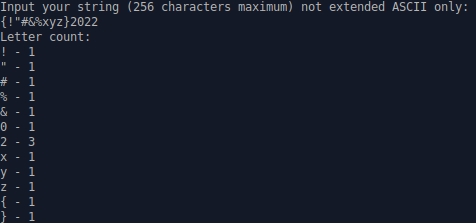
 модифицированная:  

### Тест 2:
 Входные данные: abcdefghijklmnop
 Не модифицированная:  
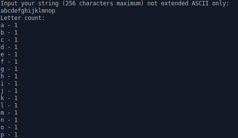
 модифицированная:  
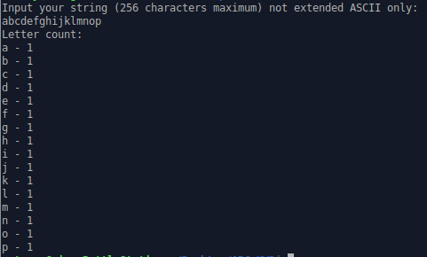
 с регистрами:  
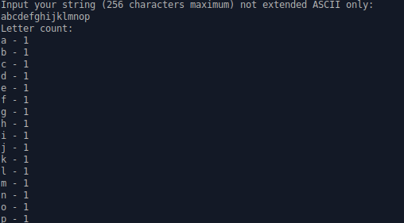
### Тест 3:
 Входные данные: 19016183
 Не модифицированная:  
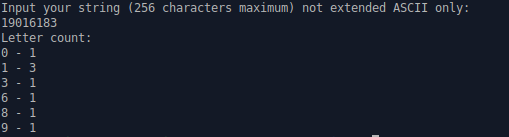
 модифицированная:  
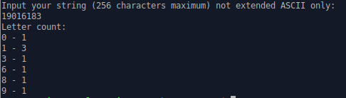
 с регистрами:  
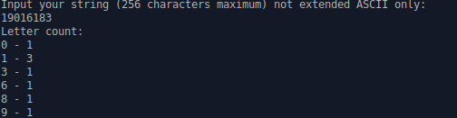
### Тест 4:
 Входные данные: <табуляция> <табуляция> <пробел>
 Не модифицированная:  
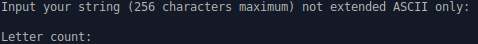
 модифицированная:  
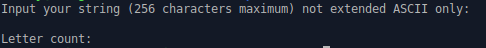
 с регистрами:  
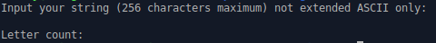
### Тест 5:
 Входные данные: The quick brown fox jumps over the lazy dog
 Не модифицированная:  
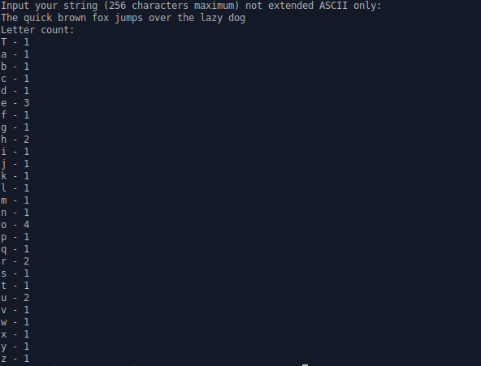
 модифицированная:  
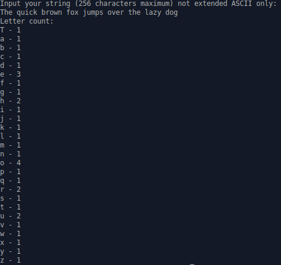
 с регистрами:  
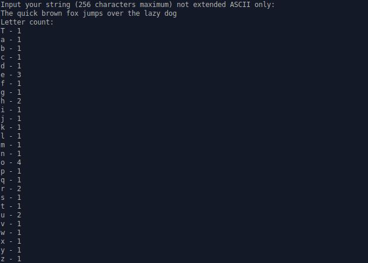
## Заключение
Обе программы работают корректно и абсолютно одинаково. Это означает, что внесенные изменения никак не повлияли на функциональность программы.
